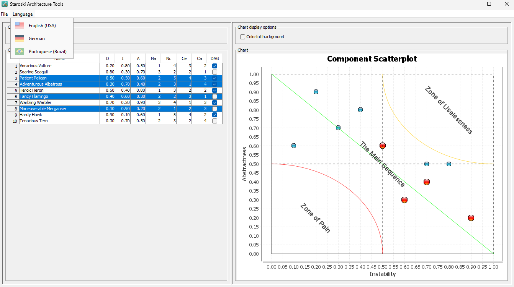

# Staroski Architecture Tools

## Description

This repository contains a set of tools designed to assist in the development, analysis, and maintenance of software architectures in Java projects. This project aims to provide functionalities that ease the life of developers and architects, promoting best practices and automation of common tasks in the software lifecycle.

The **Component Dispersion Chart** is a tool designed to analyze and visualize system metrics from a CSV file, focusing on software components. Inspired by Chapter 14 of Robert C. Martin's book "Clean Architecture," it generates a scatter plot of components based on various metrics, aiding in architectural analysis and decision-making.

The tool reads a CSV file containing metrics for each component, including:

- **Name**: Component name;
- **D**: Distance from the "Main Sequence" (a decimal value between 0.0 and 1.0);
- **I**: Instability (a decimal value between 0.0 and 1.0);
- **A**: Abstractness (a decimal value between 0.0 and 1.0);
- **Na**: Number of abstract types (an integer);
- **Nc**: Number of concrete types (an integer);
- **Ce**: Efferent coupling, i.e., outgoing dependencies (an integer);
- **Ca**: Afferent coupling, i.e., incoming dependencies (an integer);
- **DAG**: Directed Acyclic Graph indicator (1 if acyclic, 0 if cyclic).

The Component Dispersion Chart, also known as Component Scatterplot, provides a visual representation of how components are distributed based on these metrics, facilitating identification of architectural patterns, dependencies, and potential areas for refactoring or improvement.

## Example CSV File

An example CSV file (`metrics.csv`) might look like this:

```
Name,D,I,A,Na,Nc,Ce,Ca,DAG
Voracious Vulture,0.2,0.8,0.5,3,2,4,1,1
Soaring Seagull,0.8,0.3,0.7,2,1,2,3,0
Patient Pelican,0.5,0.5,0.6,4,3,5,2,1
Adventurous Albatross,0.3,0.7,0.4,1,4,3,2,1
Heroic Heron,0.6,0.4,0.8,2,2,3,1,1
Fancy Flamingo,0.4,0.6,0.3,3,1,2,2,0
Warbling Warbler,0.7,0.2,0.9,1,3,4,3,1
Maneuverable Merganser,0.1,0.9,0.2,2,3,1,2,0
Hardy Hawk,0.9,0.1,0.6,4,2,5,1,1
Tenacious Tern,0.3,0.7,0.5,2,4,3,2,0
```

## Usage

To use the Component Dispersion Chart tool:

1. Ensure your CSV file (`metrics.csv`) follows the format specified above.

### Running the Program

**Attention** you need a [JRE - Java Runtime Environment](https://adoptium.net/temurin/releases/?package=jre&version=20) installed in order to execute the tool.

Download the [JAR](dist/staroski-architecture-tools.jar) file to your computer and simple double-click it.

If it not works then you can navigate to the directory where the [JAR](dist/staroski-architecture-tools.jar) file is located and execute it in command line with:

```bash
java -jar staroski-architecture-tools.jar
```

Use the "**File -> Import CSV file**" menu to import an [CSV file](metrics.csv) into the program.

Use the "**Language**" menu to switch between **English (USA)**, **German** and **Portuguese (Brazil)**.

On the left panel you will see the **Components** and its metrics.

On the right panel you will see the visual presentation of that metrics on a **Component Scatterplot**.

The selected components will be rendered in **red** and the unselected in **blue**: 



---
